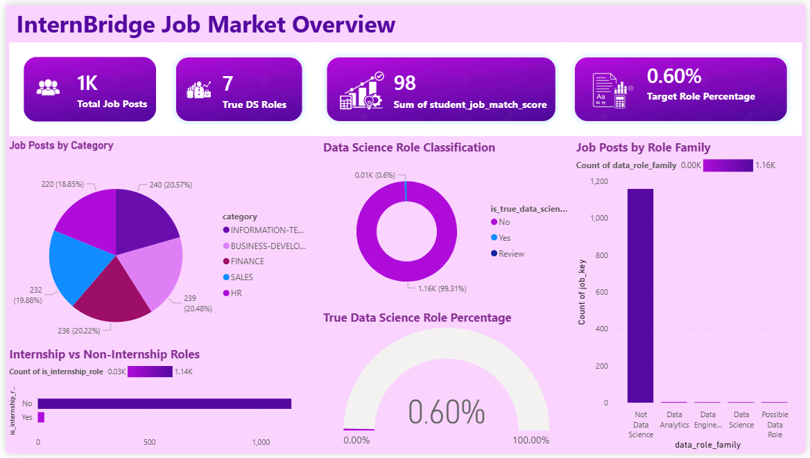
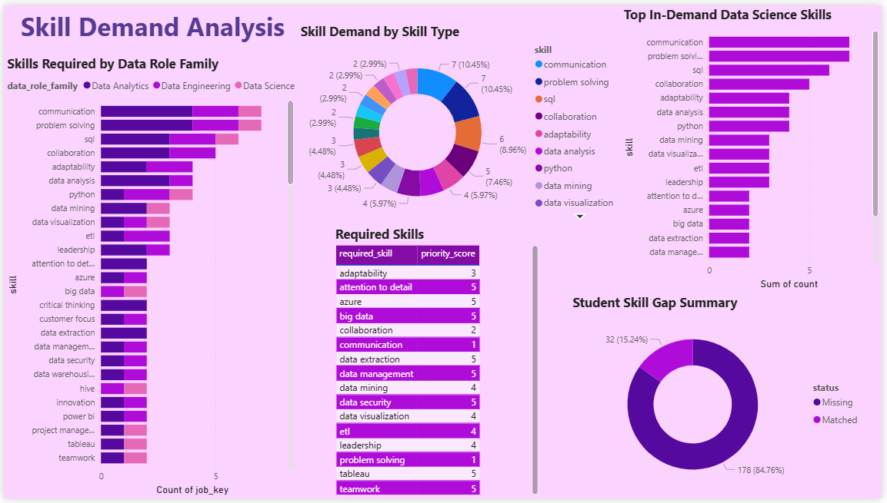
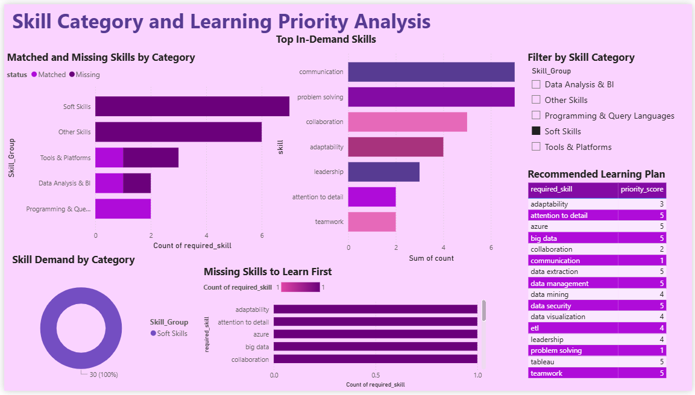
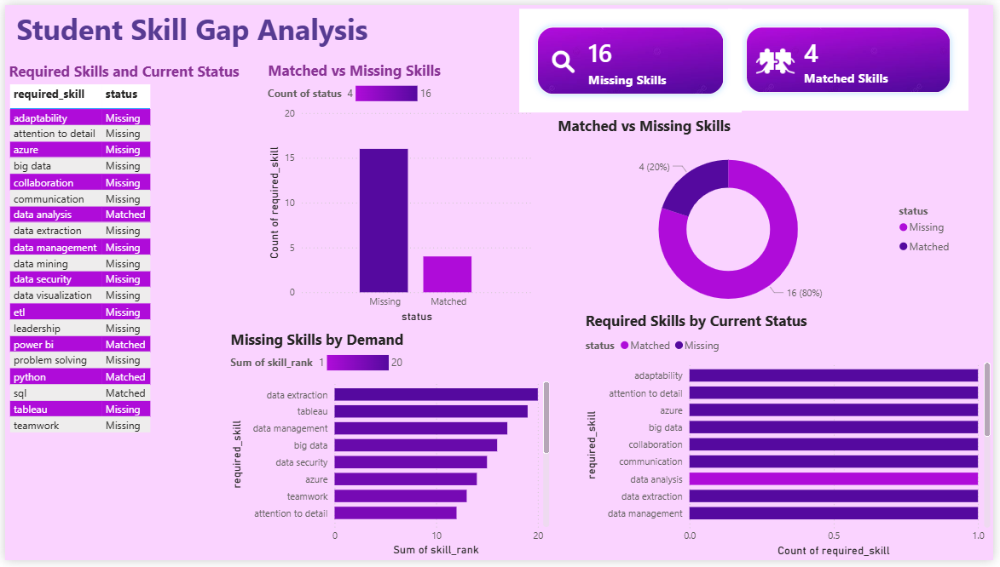
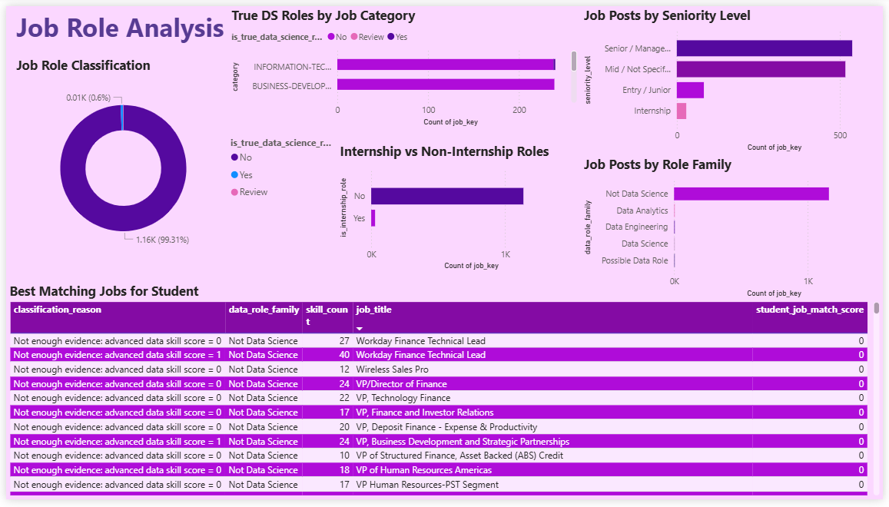

<div align="center">

# 🌉 InternBridge

## Data Science Internship Skill Gap Analyzer

A Python, NLP, and Power BI project that analyzes job descriptions, identifies genuine data science roles, detects student skill gaps, and recommends skills to learn next.


</div>

---

## 📌 Project Overview

InternBridge analyzes job descriptions to answer the following questions:

* What skills are most in demand?
* What tools are frequently mentioned?
* Which skills are missing from the student profile?
* Which jobs best match the student?
* What skills should the student learn next?

Jobs are classified into role families such as:

* Data Science
* Data Analytics
* Data Engineering
* Possible Data Role
* Not Data Science
* Manual Review

---

## 🎯 Main Features

* Job description cleaning and preprocessing
* Data science role classification
* Skill and tool extraction
* TF-IDF keyword analysis
* Student skill-gap identification
* Matched and missing skill comparison
* Learning-priority recommendations
* Student-to-job match scoring
* Interactive Power BI dashboards

---

## 📊 Key Results

| Metric                       | Result |
| ---------------------------- | -----: |
| Total job posts analyzed     |  1,167 |
| Genuine data science roles   |      7 |
| Data science role percentage |  0.60% |
| Matched student skills       |      4 |
| Missing student skills       |     16 |

These results show why accurate role classification is important. Broad keyword filtering can include many unrelated jobs in a data science analysis.

---

## 📈 Power BI Dashboard

### Job Market Overview



### Skill Demand Analysis



### Skill Category and Learning Priority Analysis



### Student Skill Gap Analysis



### Job Role Analysis



---

## 🛠️ Technologies Used

* Python
* Pandas
* NumPy
* Scikit-learn
* Natural Language Processing
* TF-IDF
* Jupyter Notebook
* Power BI
* DAX
* CSV and Excel
* Git and GitHub

---

## 🔄 Project Workflow

```text
Raw Job Data
      ↓
Data Cleaning
      ↓
Skill Extraction
      ↓
Job Role Classification
      ↓
Data Science Role Filtering
      ↓
Skill Gap Analysis
      ↓
Job Match Scoring
      ↓
Learning Recommendations
      ↓
Power BI Dashboard
```

---

## 📁 Project Structure

```text
InternBridge/
│
├── dashboard/
├── dashboard_screenshots/
├── data/
├── notebooks/
│   └── InternBridge_Analysis.ipynb
├── powerbi_ds_final_data/
├── reports/
├── .gitignore
└── README.md
```

---

## 🚀 How to Run

Clone the repository:

```bash
git clone https://github.com/chamodi-kumarage/internbridge-data-science-skill-gap-analyzer.git
```

Move into the project folder:

```bash
cd internbridge-data-science-skill-gap-analyzer
```

Install the required libraries:

```bash
pip install pandas numpy matplotlib scikit-learn openpyxl jupyter
```

Start Jupyter Notebook:

```bash
jupyter notebook
```

Open and run:

```text
notebooks/InternBridge_Analysis.ipynb
```

To view the dashboard, open the `.pbix` file inside the `dashboard` folder using Power BI Desktop.

---

## 💡 Main Insights

* Broad keyword filtering can incorrectly classify unrelated jobs as data science roles.
* Genuine data science roles represent only a small percentage of the analyzed dataset.
* Python, SQL, data analysis, and Power BI are important matching skills.
* Technical skills and soft skills are both important in the job market.
* Missing skills can be ranked to create a practical learning plan.


---

<div align="center">

⭐ Star the repository if you find this project useful.

</div>
